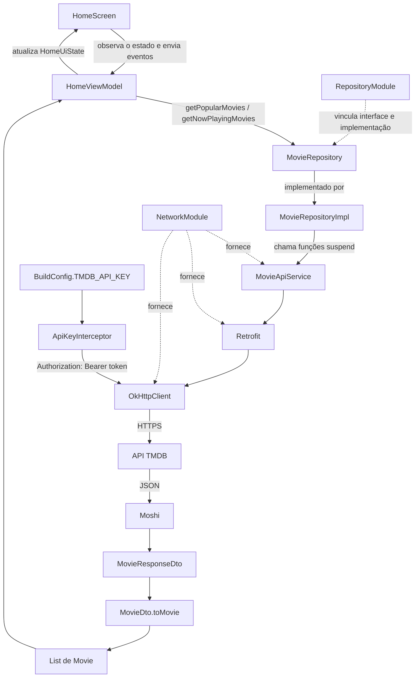

# Integração com a API do TMDB

## Visão geral

Esta documentação descreve o trabalho presente na branch `feature/api`. O objetivo
da branch é preparar o CineLog para consultar filmes populares e filmes em cartaz
na API do TMDB, transformar a resposta externa em modelos internos e disponibilizar
os dados para a tela inicial.

No estado atual, a estrutura das camadas foi implementada e a compilação Kotlin foi
validada. A integração ainda não foi executada de ponta a ponta no aplicativo; as
pendências estão registradas na seção [Estado atual e próximos passos](#estado-atual-e-próximos-passos).

## O que foi implementado

### Configuração e dependências

- Leitura de `TMDB_API_KEY` a partir do arquivo local `local.properties`.
- Geração de `BuildConfig.TMDB_API_KEY` para disponibilizar a credencial ao código.
- Retrofit para declarar e executar os endpoints HTTP.
- Conversor Moshi para transformar JSON em objetos Kotlin.
- Hilt e `javax.inject` para preparar a injeção de dependências.
- Constantes para a URL base da API e para a URL base das imagens do TMDB.
- Permissão `android.permission.INTERNET` declarada no Manifest.

O arquivo `local.properties` não é versionado. Cada ambiente de desenvolvimento
deve declarar localmente o token de leitura da API:

```properties
TMDB_API_KEY=seu_api_read_access_token
```

O valor esperado pela implementação atual é o **API Read Access Token**, pois o
interceptor envia a credencial no cabeçalho HTTP no formato:

```http
Authorization: Bearer <token>
```

> A credencial nunca deve ser adicionada ao Git. `BuildConfig` evita versionar o
> valor, mas não torna o segredo inacessível dentro de um APK distribuído.

### Camada remota

O contrato `MovieApiService` declara dois endpoints:

| Função | Endpoint | Finalidade |
| --- | --- | --- |
| `getPopularMovies()` | `GET /movie/popular` | Buscar filmes populares |
| `getNowPlayingMovies()` | `GET /movie/now_playing` | Buscar filmes em cartaz |

Ambos enviam os parâmetros `page` e `language`. Os valores padrão são página `1`
e idioma `pt-BR`.

Os objetos recebidos da API estão agrupados por recurso em
`data/remote/dto/movie`:

- `MovieResponseDto`: envelope da paginação retornada pelo TMDB;
- `MovieDto`: representação de cada filme no JSON;
- `DatesDto`: intervalo de datas que pode acompanhar a resposta de filmes em cartaz.

Esses DTOs pertencem somente à comunicação externa e não são enviados diretamente
para a interface.

### Camada de domínio

O modelo `Movie` contém apenas os dados utilizados pelo CineLog. Ele não depende de
Retrofit, Moshi ou do formato da resposta do TMDB.

O contrato `MovieRepository` expõe as operações necessárias para o restante do app:

```kotlin
suspend fun getPopularMovies(): List<Movie>
suspend fun getNowPlayingMovies(): List<Movie>
```

Essa separação impede que a camada de UI conheça detalhes da API.

### Conversão dos dados

A extensão `MovieDto.toMovie()` converte o modelo remoto em modelo de domínio. Nesse
processo ela:

- escolhe `title` e usa `originalTitle` como alternativa;
- substitui textos ausentes por valores seguros;
- monta as URLs completas de pôster e backdrop;
- arredonda a média de votos para uma casa decimal.

### Repositório

`MovieRepositoryImpl` recebe `MovieApiService` por injeção de construtor. Cada função
consulta o endpoint correspondente e converte a lista de `MovieDto` em `Movie` antes
de devolvê-la ao ViewModel.

### Injeção de dependências

`NetworkModule` descreve como criar objetos compartilhados no
`SingletonComponent`:

1. `OkHttpClient`, com o interceptor que adiciona o token;
2. `Moshi`, responsável pelo JSON;
3. `Retrofit`, configurado com URL base, cliente HTTP e conversor;
4. `MovieApiService`, criado pelo Retrofit.

`RepositoryModule` associa a interface `MovieRepository` à implementação
`MovieRepositoryImpl` por meio de `@Binds`.

### Estado da Home

`HomeViewModel` inicia o carregamento das duas listas e publica um `HomeUiState`
através de `StateFlow`. O estado reúne:

- `isLoading`: indica carregamento;
- `popularMovies`: filmes populares;
- `nowPlayingMovies`: filmes em cartaz;
- `errorMessage`: mensagem exibível em caso de falha.

O evento `HomeUiEvent.OnRetryClicked` permite repetir a chamada após um erro.

## Fluxo dos dados



Em uma chamada bem-sucedida, a sequência é:

1. O `HomeViewModel` entra no estado de carregamento.
2. O ViewModel solicita os dados ao `MovieRepository`.
3. `MovieRepositoryImpl` chama o `MovieApiService`.
4. O interceptor adiciona o token antes de o OkHttp enviar a requisição.
5. O TMDB responde com JSON.
6. Moshi converte o JSON em DTOs.
7. O mapper converte os DTOs em modelos `Movie`.
8. O ViewModel publica as listas no `HomeUiState`.
9. Em caso de exceção, o ViewModel encerra o carregamento e publica uma mensagem de erro.

## Organização dos pacotes

```text
com.reynanfc.cinelog
├── data
│   ├── mapper
│   │   └── MovieDtoMapper.kt
│   ├── remote
│   │   ├── api
│   │   │   └── MovieApiService.kt
│   │   └── dto/movie
│   │       ├── DatesDto.kt
│   │       ├── MovieDto.kt
│   │       └── MovieResponseDto.kt
│   └── repository
│       └── MovieRepositoryImpl.kt
├── di
│   ├── NetworkModule.kt
│   └── RepositoryModule.kt
├── domain
│   ├── model
│   │   └── Movie.kt
│   └── repository
│       └── MovieRepository.kt
├── ui/home
│   ├── HomeScreen.kt
│   ├── HomeUiEvent.kt
│   ├── HomeUiState.kt
│   └── HomeViewModel.kt
└── util
    └── ApiConstants.kt
```

## Estado atual e próximos passos

### Validado

- `BuildConfig.TMDB_API_KEY` é gerado a partir de `local.properties`.
- A permissão de acesso à internet está declarada no Manifest.
- Os DTOs, o mapper, o repositório, os módulos de DI e o ViewModel compilam.
- `./gradlew :app:compileDebugKotlin` terminou com `BUILD SUCCESSFUL`.

### Ainda pendente

1. Ativar o plugin e o processador KSP do Hilt.
2. Criar uma classe `Application` com `@HiltAndroidApp` e registrá-la no Manifest.
3. Anotar a `MainActivity` com `@AndroidEntryPoint`.
4. Configurar corretamente o processamento dos adapters Moshi gerados por
   `@JsonClass(generateAdapter = true)`.
5. Obter o `HomeViewModel` na `HomeScreen`, observar `uiState` e renderizar os estados
   de carregamento, sucesso e erro.
6. Executar uma chamada real em dispositivo ou emulador e confirmar o código HTTP e
   o conteúdo retornado.
7. Adicionar testes do mapper, do repositório e do ViewModel.

Até essas etapas serem concluídas, `BUILD SUCCESSFUL` confirma a compilação da
estrutura, mas não confirma que a integração esteja operacional no Android.
